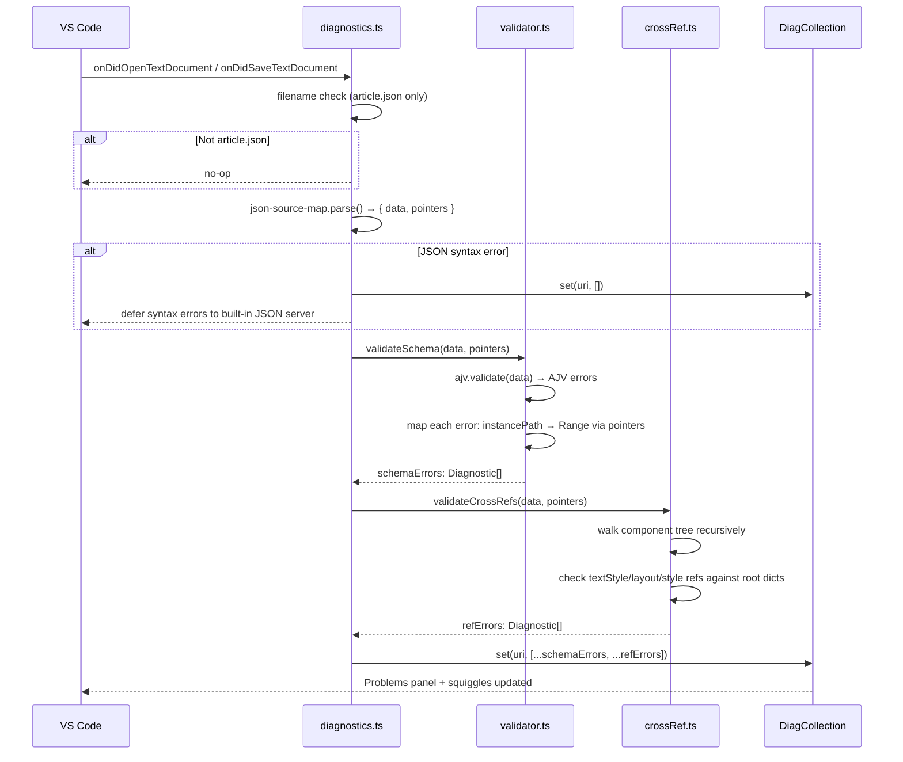

# feat: Apple News Format Validator VS Code Extension

## Summary

A VS Code extension that activates on `article.json` files, validates them against the Apple News Format (ANF) spec using AJV and a bundled JSON Schema, and surfaces actionable diagnostics with human-readable fix instructions in the Problems panel and inline squiggles. A second cross-reference pass catches dangling style and layout references — the most common real-world ANF rejection cause — which JSON Schema validation alone cannot detect.

---

## Problem Frame

Developers authoring Apple News Format articles have no in-editor validation feedback. The only official tool is Apple's News Preview macOS app, which requires drag-and-drop testing and returns opaque error messages. The Apple News Publisher API returns `INVALID_DOCUMENT` with minimal detail. This extension brings schema-level and structural validation directly into the editor, surfacing specific, actionable errors at the exact line and column where they occur.

---

## Requirements

- R1. The extension activates in any workspace containing an `article.json` file
- R2. On open and save of `article.json`, all ANF schema violations are reported as VS Code diagnostics with accurate line/column positions
- R3. Diagnostic messages are human-readable and instructive — they explain what is wrong and how to fix it (not just "invalid field")
- R4. Cross-reference violations are detected and reported: components referencing undefined entries in `componentTextStyles`, `componentLayouts`, or `componentStyles`
- R5. Diagnostics clear automatically when all errors are resolved and the file is saved
- R6. No other `.json` files are ever affected by the extension
- R7. The extension ships as a distributable `.vsix` suitable for VS Code Marketplace publishing

---

## Scope Boundaries

- No Apple News Publisher API integration — validation is entirely local and offline
- No article preview or rendering
- No ANF authoring assistance (autocomplete, IntelliSense, snippets) beyond what diagnostics naturally suggest
- No scaffolding or template creation for new `article.json` files
- No support for `.anf` bundle folders — only the `article.json` file itself
- No auto-fix code actions

### Deferred to Follow-Up Work

- Code action quick-fixes (e.g., "Add missing required field"): separate PR after initial release
- ANF version-specific validation (stricter checking keyed to the declared `version` field): future iteration
- Submitting the ANF schema to SchemaStore.org for broad ecosystem use: after schema is stable

---

## Context & Research

### Relevant Code and Patterns

- `microsoft/vscode-extension-samples` — diagnostics-sample and code-actions-sample for canonical VS Code diagnostic patterns
- `lonelyplanet/apple-news-format-schema` — archived community JSON Schema (Draft 6, ANF ~1.7); best available structural foundation. Archived June 2024, last release 2017, targets ANF ~1.7
- `Robert-Fairley/apple-news-format` npm package (ANF 1.26.0, updated Sept 2025) — TypeScript interfaces covering newer component types; use as coverage audit reference alongside the Lonely Planet schema
- `sketchytech/AppleNewsFormat` GitHub repo — collection of minimal valid ANF JSON fixtures for test coverage

### Institutional Learnings

- No prior ANF or VS Code extension projects in this workspace

### External References

- [VS Code Programmatic Language Features](https://code.visualstudio.com/api/language-extensions/programmatic-language-features)
- [VS Code Activation Events](https://code.visualstudio.com/api/references/activation-events)
- [VS Code Extension Manifest](https://code.visualstudio.com/api/references/extension-manifest)
- [VS Code Bundling Extensions (esbuild)](https://code.visualstudio.com/api/working-with-extensions/bundling-extension)
- [AJV Validation Errors API](https://ajv.js.org/api.html#validation-errors)
- [json-source-map by epoberezkin](https://github.com/epoberezkin/json-source-map)
- [ANF ArticleDocument reference](https://developer.apple.com/documentation/applenewsformat/articledocument/)
- [ANF Version History](https://developer.apple.com/documentation/apple_news/apple_news_format/apple_news_format_version_history)
- [ANF Release Notes](https://developer.apple.com/documentation/applenews/apple-news-format-release-notes)

---

## Key Technical Decisions

- **Schema source**: No official ANF JSON Schema exists. Build a custom `article.schema.json` using the Lonely Planet archived schema (Draft 6) as the structural foundation, augmented with component types and property shapes from the Robert-Fairley ANF 1.26.0 TypeScript package. Store as a bundled file to avoid any network dependency at validation time.
- **Validation library**: AJV v8 + `json-source-map`. AJV v8 dropped built-in Draft 4/6 support — the bundled schema should use a Draft 7 `$schema` URI (which AJV v8 supports natively) rather than Draft 6, eliminating the need for the `ajv-draft-04` compatibility shim. If Draft 6 features are needed, add `ajv-draft-04` and register the meta-schema explicitly. AJV configured with `allErrors: true` and `strict: false` to avoid unknown-format errors on ANF-specific format strings. `json-source-map` chosen over `jsonc-parser` AST traversal because it directly maps RFC 6901 JSON Pointers — exactly what AJV produces — to line/column positions with no manual traversal needed.
- **Cross-reference validation**: Custom post-schema TypeScript logic (not AJV custom keywords) that walks the component tree and checks that every `textStyle`, `layout`, and `style` string reference resolves to a defined key in the root dictionaries. This catches the most common real-world ANF API rejection cause and cannot be expressed in JSON Schema.
- **Trigger strategy**: Validate on `onDidOpenTextDocument` and `onDidSaveTextDocument` only — not on every keystroke. ANF files are typically generated or hand-edited in bulk; per-keystroke validation on partial JSON would produce misleading parse errors.
- **JSON parsing ownership**: `json-source-map.parse()` is called once in `diagnostics.ts` and the resulting `{ data, pointers }` is passed to both the schema validator and the cross-reference validator — no double-parse.
- **Error messages**: Custom message builder (not raw AJV messages) keyed by AJV error keyword + ANF path context. `required` errors name the missing property; `pattern` errors explain the valid format; `type` errors state the expected type.
- **Build tooling**: esbuild with `vscode` marked external. AJV and `json-source-map` moved to `devDependencies` after bundling so `vsce` does not double-ship them in `node_modules`.
- **engines.vscode**: `^1.90.0` (June 2024 baseline) — no newer APIs needed; maximizes compatibility.
- **Activation**: `workspaceContains:**/article.json` is the sole activation event. `onLanguage:json` is intentionally excluded — it fires for every JSON file in VS Code, causing broad activation that contradicts R6's intent and wastes memory for users who never open ANF files. The standalone-file-open edge case (user opens `article.json` outside a workspace folder) is handled inside `activate()` by iterating `vscode.workspace.textDocuments` at activation time and running `refreshDiagnostics` on any document whose basename is `article.json`.

---

## Open Questions

### Resolved During Planning

- **Does Apple publish an official ANF JSON Schema?** No. The only official validation tool is the News Preview macOS app. The Lonely Planet archived schema is the best available foundation.
- **Validate on every keystroke?** No — save and open events only. Partial JSON during editing causes misleading parse errors; ANF files are not incrementally edited character-by-character.
- **AJV vs. Zod?** AJV — the schema is expressed as JSON Schema (not TypeScript types), and AJV operates natively on JSON Schema documents with per-error JSON Pointer paths needed for range mapping.

### Deferred to Implementation

- **ANF schema coverage gaps**: Exactly how many of the 22+ component role types and their per-type property constraints the bundled schema covers vs. what's missing will be discovered during schema authoring (U2). A `// TODO: coverage gap` comment convention in the schema tracks this.
- **AJV pointer edge cases**: Whether all AJV error `instancePath` values (especially for `additionalProperties`, `anyOf`, `oneOf`) resolve cleanly to `json-source-map` pointer entries will be discovered during U3 implementation; defensive fallback ranges are added where needed.

---

## Output Structure

    anf-validator/
    ├── src/
    │   ├── extension.ts          # activate() / deactivate()
    │   ├── diagnostics.ts        # document event subscriptions + orchestration
    │   ├── validator.ts          # AJV schema validation + position mapping
    │   ├── crossRef.ts           # cross-reference (style/layout ref) validation
    │   ├── messages.ts           # human-readable diagnostic message builders
    │   └── schema/
    │       └── article.schema.json
    ├── test/
    │   ├── fixtures/
    │   │   ├── valid-minimal.json
    │   │   ├── valid-full.json
    │   │   ├── invalid-missing-required.json
    │   │   ├── invalid-identifier-format.json
    │   │   ├── invalid-cross-ref-style.json
    │   │   └── invalid-cross-ref-layout.json
    │   └── validator.test.ts
    ├── dist/
    │   └── extension.js          # esbuild output
    ├── media/
    │   └── icon.png
    ├── .vscode/
    │   └── launch.json
    ├── package.json
    ├── tsconfig.json
    ├── esbuild.js
    ├── .vscodeignore
    ├── .gitignore
    ├── README.md
    └── CHANGELOG.md

---

## High-Level Technical Design

> *This illustrates the intended approach and is directional guidance for review, not implementation specification. The implementing agent should treat it as context, not code to reproduce.*

---

## Implementation Units

### U1. Project Scaffold

**Goal:** Create the complete TypeScript VS Code extension project structure with all config files, build tooling, and debug launch configuration.

**Requirements:** R7

**Dependencies:** None

**Files:**
- Create: `package.json`
- Create: `tsconfig.json`
- Create: `esbuild.js`
- Create: `.vscodeignore`
- Create: `.gitignore`
- Create: `.vscode/launch.json`
- Create: `CHANGELOG.md`
- Create: `src/extension.ts` (empty activate/deactivate shell, wired in U5)

**Approach:**
- `package.json` sets `engines.vscode: "^1.90.0"`, `main: "./dist/extension.js"`, `activationEvents: ["workspaceContains:**/article.json"]`, `categories: ["Linters"]`
- Standalone-file-open edge case (article.json opened outside a workspace) handled inside `activate()` via `vscode.workspace.textDocuments` iteration — no `onLanguage:json` needed
- esbuild script marks `vscode` as external, formats output as CommonJS, bundles to `dist/extension.js`
- AJV and json-source-map start as `dependencies`; moved to `devDependencies` after confirming esbuild bundles them (verified via `npx vsce ls`)
- `tsconfig.json` targets ES2022, `module: "Node16"`, `strict: true`
- `.vscode/launch.json` configures an Extension Host debug configuration pointing to `dist/extension.js`

**Patterns to follow:**
- `microsoft/vscode-extension-samples` package.json structure
- VS Code Extension Manifest reference

**Test scenarios:**
- Test expectation: none — this unit is configuration scaffolding with no behavioral logic

**Verification:**
- `node esbuild.js` completes without errors and produces `dist/extension.js`
- `tsc --noEmit` passes with no type errors
- Extension Host debug run (F5 in VS Code) launches without crashes

---

### U2. ANF JSON Schema

**Goal:** Produce a comprehensive `article.schema.json` (JSON Schema Draft 6) covering all 7 required root fields with their format constraints, all known component roles, and the style/layout object shapes.

**Requirements:** R2, R3, R4

**Dependencies:** None (can be authored in parallel with U1)

**Files:**
- Create: `src/schema/article.schema.json`

**Approach:**
- Start from the Lonely Planet `lonelyplanet/apple-news-format-schema` schema as structural base (Draft 6, available at its raw GitHub URL)
- Verify and enforce the 7 required root fields and their constraints:
  - `version`: string matching `^[0-9]+\.[0-9]+$`
  - `identifier`: string matching `^[a-zA-Z0-9_-]{1,64}$`
  - `title`: non-empty string
  - `language`: IANA language tag string
  - `layout`: object with required sub-properties `columns` (integer) and `width` (number)
  - `components`: array with `minItems: 1`, each item requiring a `role` string
  - `componentTextStyles`: object
- Audit component type coverage against Robert-Fairley ANF 1.26.0 TypeScript interfaces — add `role` enum values for component types introduced after ANF 1.7
- The component `role` field is modeled as an open `enum` (not `const` with strict matching) to avoid false positives when Apple adds new roles in future ANF versions
- Root-level `additionalProperties: false` is preserved from the Lonely Planet schema to catch stray top-level keys
- Mark incomplete component-type-specific property constraints with `// TODO: coverage gap — ANF <version>` comments so gaps are trackable
- Add a header comment block: `// ANF coverage target: 1.26.0` for version tracking

**Patterns to follow:**
- `lonelyplanet/apple-news-format-schema` structural conventions
- [ANF ArticleDocument reference](https://developer.apple.com/documentation/applenewsformat/articledocument/)

**Test scenarios:**
- Happy path: a known-valid minimal ANF article validates with zero errors against the schema
- Happy path: a known-valid full ANF article (nested containers, photos, text styles) validates with zero errors
- Edge case: root object missing each of the 7 required fields individually → exactly one `required` error per missing field
- Edge case: `identifier` value containing a space → fails `pattern`
- Edge case: `identifier` value with 65 characters → fails `maxLength`
- Edge case: `version: "1"` (no minor component) → fails `pattern`
- Edge case: `components: []` (empty array) → fails `minItems`
- Edge case: unrecognized top-level property present → fails `additionalProperties`
- Edge case: `layout` missing `columns` → nested `required` error pointing into the layout object

**Verification:**
- Running AJV directly against the schema and the valid-minimal fixture produces zero errors
- All edge case scenarios above produce errors when validated against the schema
- Schema file is valid JSON Schema Draft 6 (AJV compiles it without errors)

---

### U3. Validator Core

**Goal:** Implement `src/validator.ts` and `src/messages.ts` — the pure schema validation function that accepts parsed article data and a `json-source-map` pointers map, runs AJV, maps error paths to `vscode.Range` objects, and returns `vscode.Diagnostic[]`.

**Requirements:** R2, R3

**Dependencies:** U1, U2

**Files:**
- Create: `src/validator.ts`
- Create: `src/messages.ts`
- Create: `test/validator.test.ts`
- Create: `test/fixtures/valid-minimal.json`
- Create: `test/fixtures/valid-full.json`
- Create: `test/fixtures/invalid-missing-required.json`
- Create: `test/fixtures/invalid-identifier-format.json`

**Approach:**
- AJV instance and compiled validate function are module-level singletons (created once at module load, not per-call)
- `validateSchema(data: unknown, pointers: Pointers): vscode.Diagnostic[]` is the exported function signature — no TextDocument dependency, making it unit-testable without a VS Code host
- Each AJV error is mapped: `err.instancePath` → `parsed.pointers[instancePath]` → `vscode.Range` using the pointer's `value` and `valueEnd` positions
- `required` keyword special case: `instancePath` points to the parent object; construct range from the parent pointer's value start; message names the missing property via `err.params.missingProperty`
- Root-level errors (`instancePath === ""`) use the document's first token as the range fallback
- Unresolvable pointer entries (pointer key not in map) fall back to `Range(0,0,0,0)` without throwing
- `messages.ts` exports `buildMessage(err: AJV.ErrorObject): string` covering at minimum: `required`, `pattern`, `type`, `minLength`, `maxLength`, `minItems`, `enum`, `additionalProperties`
- Each `Diagnostic` has `.source = "anf-validator"` and `.code = err.keyword`
- AJV is configured with `allErrors: true` so all violations surface in one pass

**Patterns to follow:**
- AJV error object structure (`instancePath`, `keyword`, `params`, `message`)
- `microsoft/vscode-extension-samples` diagnostics pattern

**Test scenarios:**
- Happy path: valid-minimal fixture → empty diagnostics array
- Happy path: valid-full fixture → empty diagnostics array
- Error path: fixture missing `title` → one diagnostic with message containing `Missing required property "title"`
- Error path: `identifier` value with spaces → diagnostic at the identifier value range; message explains the valid character set
- Error path: `identifier` value with 65 characters → diagnostic at identifier value range; message explains max 64 characters
- Error path: `version: "1"` → diagnostic at version value range; message explains `major.minor` format requirement
- Error path: `components: []` → diagnostic at the components array value range
- Edge case: syntactically invalid JSON string passed as raw text → caller handles the parse exception before calling `validateSchema`; the function itself never receives unparseable input
- Edge case: `instancePath` with no matching pointer entry → returns a diagnostic with first-line fallback range, does not throw

**Verification:**
- All test scenarios pass
- `tsc --noEmit` type-checks without errors
- `validateSchema` runs against a 50KB test fixture in under 100ms

---

### U4. Cross-Reference Validator

**Goal:** Implement `src/crossRef.ts` — a secondary validation pass that walks the parsed article component tree and verifies that every component `textStyle`, `layout`, and `style` string reference resolves to a defined key in the corresponding root dictionary.

**Requirements:** R4

**Dependencies:** U1, U2, U3

**Files:**
- Create: `src/crossRef.ts`
- Create: `test/fixtures/invalid-cross-ref-style.json`
- Create: `test/fixtures/invalid-cross-ref-layout.json`
- Modify: `test/validator.test.ts` (add cross-ref test cases)

**Approach:**
- `validateCrossRefs(data: unknown, pointers: Pointers): vscode.Diagnostic[]` is the exported function
- Receives the same `data` and `pointers` already produced by `json-source-map.parse()` — no additional parsing
- Traverses `article.components` recursively (container component types — `container`, `section`, `chapter`, `header` — can nest components via their own `components` array property)
- For each component, checks three optional string properties:
  - `textStyle` → key must exist in `article.componentTextStyles`
  - `layout` → key must exist in `article.componentLayouts` (when the root dict is defined)
  - `style` → key must exist in `article.componentStyles` (when the root dict is defined)
- All dangling references are `DiagnosticSeverity.Error` — Apple's API rejects them at publish time
- When a root dictionary (`componentLayouts`, `componentStyles`) is absent entirely but a component references a key by name, that is also an `Error` (the reference is unresolvable)
- Diagnostic range points to the value of the offending property using the `pointers` map and the component's path in the JSON tree
- `.source = "anf-validator"`, `.code = "cross-ref"`

**Patterns to follow:**
- Same pointer-to-range mapping approach as `validator.ts`

**Test scenarios:**
- Happy path: component with `textStyle: "default"` and `componentTextStyles.default` defined → zero cross-ref diagnostics
- Error path: component with `textStyle: "myStyle"` but no `"myStyle"` key in `componentTextStyles` → one diagnostic pointing to the `textStyle` value
- Error path: component with `layout: "fullWidth"` when `componentLayouts` is defined but has no `"fullWidth"` key → one error diagnostic
- Error path: component with `layout: "fullWidth"` when `componentLayouts` is absent entirely → one error diagnostic
- Error path: nested container with a dangling ref in a child component → diagnostic correctly targets the nested component's property (not the parent)
- Edge case: `components` array is absent or empty → zero cross-ref diagnostics, no crash
- Edge case: component with no `textStyle`, `layout`, or `style` properties → zero cross-ref diagnostics

**Verification:**
- All test scenarios pass
- Cross-ref diagnostics appear with correct squiggle positions in a manual Extension Host test with `invalid-cross-ref-style.json`

---

### U5. VS Code Extension Integration

**Goal:** Wire up `src/extension.ts` and `src/diagnostics.ts` to register the diagnostic collection, subscribe to document events, orchestrate the parse + validate + cross-ref pipeline, and manage diagnostic lifecycle.

**Requirements:** R1, R2, R5, R6

**Dependencies:** U1, U3, U4

**Files:**
- Modify: `src/extension.ts` (replace empty shell with real activate/deactivate)
- Create: `src/diagnostics.ts`

**Approach:**
- `extension.ts` is thin: creates the `DiagnosticCollection` once (`vscode.languages.createDiagnosticCollection("anf-validator")`), calls `subscribeToDocumentChanges(context, collection)`, pushes the collection to `context.subscriptions` for automatic disposal
- `diagnostics.ts` subscribes to three events: `onDidOpenTextDocument`, `onDidSaveTextDocument`, `onDidCloseTextDocument`
- On open/save: calls `refreshDiagnostics(doc, collection)` which:
  1. Bails immediately if `path.basename(doc.fileName) !== "article.json"`
  2. Calls `json-source-map.parse(doc.getText())` — on parse exception, sets empty diagnostics and returns
  3. Calls `validateSchema(data, pointers)` from `validator.ts`
  4. Calls `validateCrossRefs(data, pointers)` from `crossRef.ts`
  5. Calls `collection.set(doc.uri, [...schemaErrors, ...refErrors])`
- On close: `collection.delete(doc.uri)` to clear diagnostics
- On `activate`: if `vscode.window.activeTextEditor` is already open, run `refreshDiagnostics` on it immediately (handles VS Code opened with `article.json` already in view)

**Patterns to follow:**
- `subscribeToDocumentChanges` pattern from `microsoft/vscode-extension-samples/diagnostics-sample`

**Test scenarios:**
- Integration: extension activates when a workspace containing `article.json` is opened
- Integration: opening `invalid-missing-required.json` (renamed to `article.json`) populates the Problems panel with expected entries
- Integration: saving the file after fixing all errors clears all diagnostics
- Integration: opening `settings.json` (not `article.json`) produces zero diagnostics and does not appear in Problems panel
- Integration: closing `article.json` removes its entry from the Problems panel
- Happy path: opening a fully valid `article.json` produces zero diagnostics

**Verification:**
- F5 Extension Host launch succeeds without errors
- Opening a fixture with known errors shows correct squiggles and Problems panel entries
- Hovering a squiggle shows the human-readable message from `messages.ts`
- Opening a non-`article.json` file leaves the Problems panel empty for that file

---

### U6. README, Marketplace Metadata, and Publishing Prep

**Goal:** Write the extension README, finalize marketplace metadata fields in `package.json`, verify `.vscodeignore` excludes development artifacts, and produce a clean `.vsix` that can be published.

**Requirements:** R7

**Dependencies:** U1–U5

**Files:**
- Create: `README.md`
- Create: `media/icon.png`
- Modify: `package.json` (add `publisher`, `repository`, `galleryBanner`, `keywords`, `icon` fields)
- Modify: `.vscodeignore` (verify and finalize)
- Move AJV and json-source-map from `dependencies` to `devDependencies` in `package.json`

**Approach:**
- README sections: overview, features (with diagnostic example screenshot or ASCII example), installation, what gets validated (list of schema rules and cross-reference checks), known limitations (schema targets ANF ~1.26.0; coverage gaps noted), contributing, license
- `galleryBanner: { "color": "#1D1D1F", "theme": "dark" }` matches Apple News aesthetic
- `.vscodeignore` excludes `src/**`, `test/**`, `node_modules/**`, `esbuild.js`, `tsconfig.json`, `**/*.ts`, `**/*.map`; includes `dist/**`, `media/**`
- `npx vsce ls` must confirm the package contains only `dist/extension.js`, `package.json`, `README.md`, `CHANGELOG.md`, `media/icon.png` (and no `node_modules/`)

**Patterns to follow:**
- VS Code Extension Manifest reference
- `@vscode/vsce` publishing docs

**Test scenarios:**
- Test expectation: none — this unit is documentation and packaging configuration
- Structural check: `npx vsce package` completes without warnings about missing required fields or oversized bundle

**Verification:**
- `npx vsce ls` output contains only the expected files with no `node_modules` directory
- `npx vsce package` produces a `.vsix` under 1MB
- Installing the `.vsix` locally (`Extensions: Install from VSIX...`) and opening a workspace with `article.json` activates the extension successfully

---

## System-Wide Impact

- **Interaction graph:** The extension interacts only with the VS Code diagnostic API and the local file system. No network calls at validation time. The built-in VS Code JSON language server continues to handle syntax errors and JSON IntelliSense independently.
- **Error propagation:** JSON parse errors are silently deferred to VS Code's built-in JSON language server (which already handles syntax). AJV errors and cross-ref errors are converted to Diagnostics and surfaced — exceptions never propagate to the extension host.
- **State lifecycle risks:** The `DiagnosticCollection` is the only persistent state. It is cleared per-document on close and replaced atomically on each open/save — no stale diagnostic accumulation risk.
- **API surface parity:** N/A — this extension exports no API and has no downstream consumers.
- **Integration coverage:** The VS Code Extension Host test (U5) is the critical test that unit tests alone cannot prove — it verifies the full activation → event subscription → parse → validate → diagnostic rendering pipeline end-to-end.
- **Unchanged invariants:** VS Code's own JSON language features (syntax highlighting, formatting, `$schema`-based validation) are not affected. This extension adds diagnostics only and does not register any language provider that would conflict with the built-in JSON server.

---

## Risks & Dependencies

| Risk | Mitigation |
|------|------------|
| Lonely Planet schema targets ANF ~1.7; newer component types absent cause false negatives | Audit against Robert-Fairley ANF 1.26.0 types during U2; document gaps with `// TODO` comments in schema |
| AJV `json-source-map` pointer resolution fails for complex `anyOf`/`oneOf` errors | Add defensive fallback range (first-line) for unresolvable pointers; log unresolved paths in dev builds |
| ANF spec changes with future Apple OS releases (spec is additive, updated annually) | Schema is a versioned standalone file; update independently when ANF release notes announce changes |
| Standalone `article.json` opens outside a workspace folder not caught by `workspaceContains` | Handle in `activate()` by iterating `vscode.workspace.textDocuments` at activation time — no `onLanguage:json` needed |
| AJV v8 dropped built-in Draft 4/6 support; schema using Draft 6 `$schema` URI causes compile error | Use Draft 7 `$schema` URI in `article.schema.json` (AJV v8 supports Draft 7 natively); fallback: add `ajv-draft-04` shim |
| `vsce package` includes `node_modules` if AJV/json-source-map remain in `dependencies` | Move both to `devDependencies` in U6 after confirming esbuild bundles them; verify with `npx vsce ls` |

---

## Documentation / Operational Notes

- After the schema stabilizes post-launch, submit `article.schema.json` to [SchemaStore.org](https://www.schemastore.org/) — this enables VS Code's built-in JSON language service to offer schema validation and hover documentation for users who don't install the extension
- Add a `// ANF coverage target: 1.26.0` comment block at the top of `article.schema.json` for version tracking
- Monitor [ANF Release Notes](https://developer.apple.com/documentation/applenews/apple-news-format-release-notes) for new component types or field constraints introduced with each Apple OS release

---

## Sources & References

- [VS Code Programmatic Language Features](https://code.visualstudio.com/api/language-extensions/programmatic-language-features)
- [VS Code Activation Events](https://code.visualstudio.com/api/references/activation-events)
- [VS Code Extension Manifest](https://code.visualstudio.com/api/references/extension-manifest)
- [VS Code Bundling Extensions](https://code.visualstudio.com/api/working-with-extensions/bundling-extension)
- [AJV Validation Errors](https://ajv.js.org/api.html#validation-errors)
- [json-source-map](https://github.com/epoberezkin/json-source-map)
- [ANF ArticleDocument reference](https://developer.apple.com/documentation/applenewsformat/articledocument/)
- [ANF Version History](https://developer.apple.com/documentation/apple_news/apple_news_format/apple_news_format_version_history)
- [lonelyplanet/apple-news-format-schema (archived)](https://github.com/lonelyplanet/apple-news-format-schema)
- [Robert-Fairley/apple-news-format (ANF 1.26.0)](https://github.com/Robert-Fairley/apple-news-format)
- [sketchytech/AppleNewsFormat sample fixtures](https://github.com/sketchytech/AppleNewsFormat)
- [microsoft/vscode-extension-samples](https://github.com/microsoft/vscode-extension-samples)
